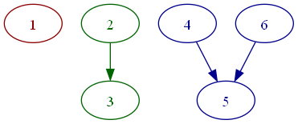
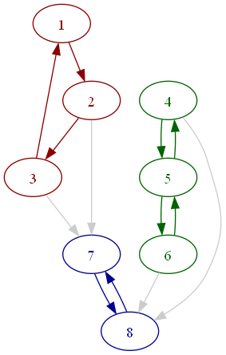
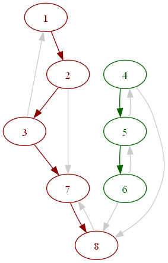

# EXA Graf

𝔼𝕏tr𝔸 𝔼li𝕏ir 𝔸dditions (𝔼𝕏𝔸)

EXA project index: [exa](https://github.com/red-jade/exa)

Data structure, algorithms and file I/O for directed graphs.

Module path: `Exa.Graf`

## Graph Model

The current version is restricted to simple directed graphs:
- nodes are labelled by positive integers
- edges are unlabelled and unweighted
- edges are always directed
- cycles are allowed
- no multi-edges: 
  at most one edge in a given direction between a pair of nodes
- self-loops are allowed: 
  edge from a node to itself
- unconnected graphs are allowed: 
  the graph may have more than one component

Any properties for graph elements are maintained
as separate `Map` indexes for other attributes
(e.g. colors and styles for drawing the graph).
These are not (yet) maintained within the graph data structure.

Undirected graphs can be represented or analyzed in two ways:
- provide edges in both directions between connected nodes,
  then use _strongly connected_ flag for algorithms
- use _weakly connected_ flag for algorithms

## Features

The _adj_ functional data structure for directed graphs,
based on in-memory adjacency lists.

A _dig_ wrapper around the Erlang `digraph` module,
with data stored in ETS (in-memory database process).

An abstraction for both graphs types,
using a _behaviour_ API and a generic `Exa.Graf.Graf` interface.
`Graf` uses the core `Exa.Dispatch` to send calls
to the specific implementation.

Conversion between different representations.

A generic and flexible way to build graphs from
vertices, vertex ranges, edges, chains and adjacency lists.

Simple access for graph elements, such as 
lists of elements, presence of specific vert/edge
and vertex classification.

Functions to find:
- vertex degrees
- neighborhoods
- reachability sets
- frontier sets
- degree histograms (1D, 2D, 3D)
- connected components (weak & strong)
- condensed strong components
- tree test and root finder

Utilities based on depth-first search (DFS)
and breadth-first search (BFS):
- graph traversal
- spanning forest 
- forest traversal
- preorder/postorder
- cyclic test

Build 1D, 2D and 3D histograms from vertex degrees.

Generate topological hashes for a graph using
in/out degree histograms:
- 0-hop: for each vertex
- 1-hop: for each vertex and its in/out neighbors

Find isomorphism between two graphs by using hashes for quick rejection tests,
then permuting vertices in hash equivalence classes 
to find a vertex relabelling that makes the graphs equal.

Contract edges and linear nodes.
Test topological equivalence (homeomorphism) 
by contracting all linear edges
then comparing for isomorphism.

Relabelling of graphs to permute vertex identifiers.
Combining graphs using _merge_ of vertices and edges,
or _disjoint_ independent addition.

Serialization of _adj_ data to/from files 
using Elixir term format.

## Repository

An in-memory store of graphs keyed by structural hashes,
which supports queries for isomorphism and homeomorphism.

## Drawing

Serialization to/from GraphViz DOT format.

Rendering of GraphViz DOT files 
to PNG, SVG images and other formats
(if you have GraphViz DOT installed).

Drawing can use structural properties of the graph
to determine colors and styles.
For example, color nodes and edges based on components.

Here is a graph with 3 weakly connected components:



This graph has 3 strongly connected components:



The same graph showing the Depth First Forest (DFF) of trees:



## Graph Mutability

The `Exa.Graf.Graf` generic interface supports two graph types:
- `adj`, in-memory in-process functional data structure
- `dig` (Erlang `digraph`) stores data in-memory out-of-process in ETS

Adj is a functional data structure, so every mutation generates
a new version of the graph. Dig is a mutable stateful data structure
maintained in a separate process. 

Mutations to dig graphs will mutate previous references,
so any derived values must be captured before mutation.

For example, consider adding a vertex to a graph:

```
g1 = Graf.new(type, "test")
n1 = Graf.nvert(g1)

g2 = Graf.add(g1,1)
n2 = Graf.nvert(g2)

n = Graf.nvert(g1)
```

If the _type_ is `:adj` the data is functional,
so `n == n1 == 0` and `Graf.equal?(g1,g2) == false`.

If the _type_ is `:dig` the data is mutated, 
so `n == n2 == 1` and `Graf.equal?(g1,g2) == true`.

Operations that mutate graphs are:
  - `add/2`
  - `delete/2`
  - `join/3` 1st argument only
  - `contract_xxx` for edges, linears, nodes, etc.
  
Dig graphs should call `delete/1` to delete the graph resources
stored in ETS. Deleting an adj graph is a no-op.

## Building

**To bootstrap an `exa_xxx` library build,**<br>
**you must update dependencies twice.**

One way to start a build is:
```
  $ mix deps.update exa
  $ mix deps.get
```

## EXA License

EXA source code is released under the MIT license.

EXA code and documentation are:<br>
Copyright (c) 2025 Mike French
